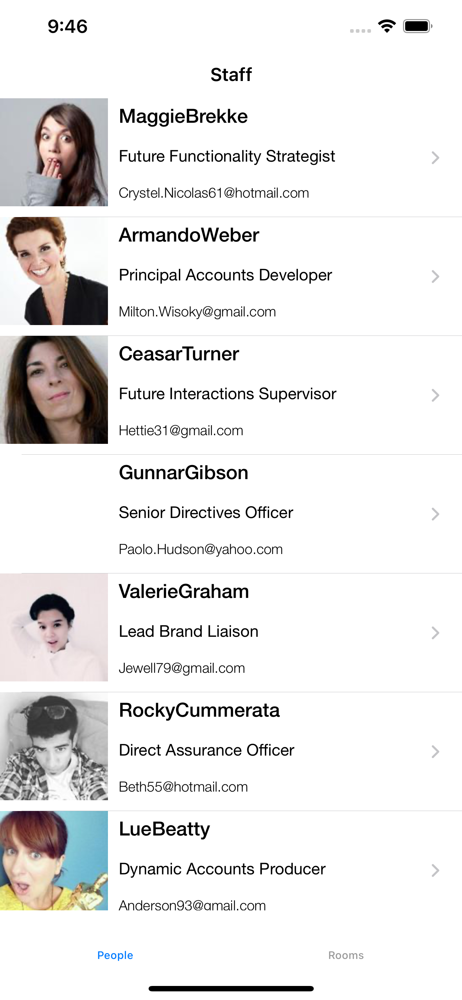
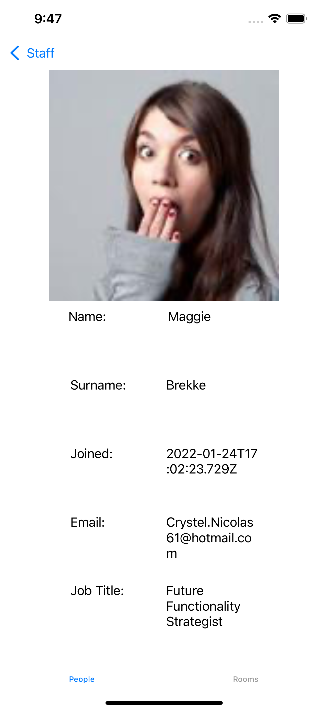
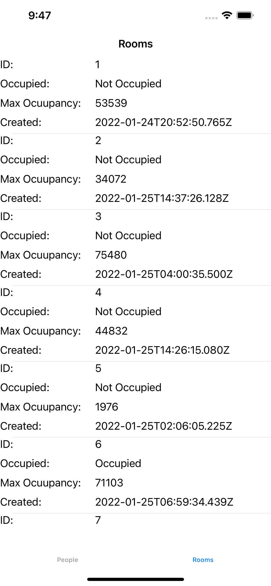

# StaffsDirectory (Model, View, View Model, Coordinator)

## Sample App

## Description

  1. Using MVVM-C architecture 
  2. Using protocol delegate pattern for data binding. 
  3. Using Singleton Pattern for Image Caching 
  4. Using UITableView for creating list 
  5. Using UITabBarController and NavigatoinController as container
# Modules

 # 1. People 
    this displayes list of Staffs and on seleting staff navigate to details screen. 
 # 2. Rooms
    this displays list of rooms 
    
### Unit Test 
 
* used fakeServiceManager class to input this class to mock api  behaviour 

## Requirements

- Xcode 13.0+
- Swift 5.2+

## Installation

## Author

Narasimha 
